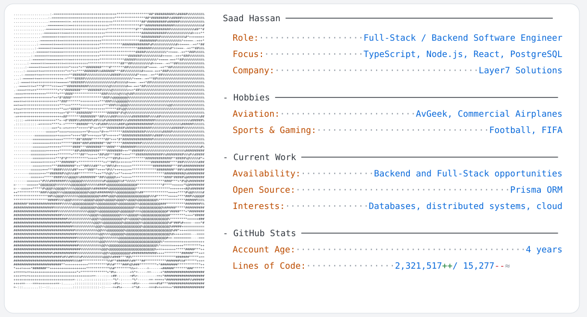

<picture>
  <source media="(prefers-color-scheme: dark)" srcset="assets/profile-dark.svg">
  <source media="(prefers-color-scheme: light)" srcset="assets/profile-light.svg">
  
</picture>

<!--
  The statistics above are refreshed daily by .github/workflows/update-profile.yml.
  “Lines of Code” is an approximate Git-based total: squash merges, changed author
  identities, rewritten history, clone-depth limits, and private repositories can
  make it differ from a lifetime total.
-->

  <a href="https://www.linkedin.com/in/saadh4/">LinkedIn</a> ·
  <a href="https://github.com/Shgit29">GitHub</a>

